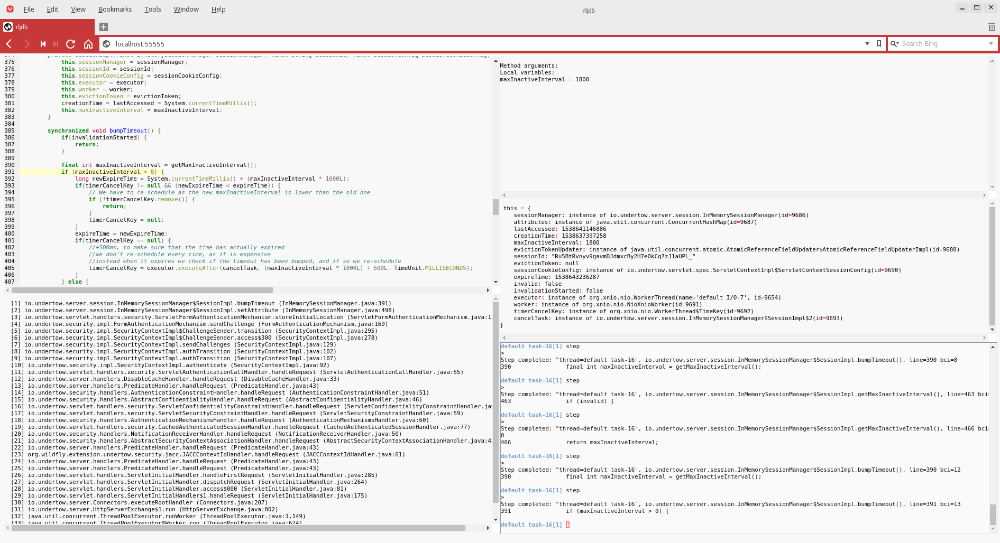

# rljdb

[][license]

[license]: https://github.com/hokuda/rljdb/blob/master/LICENSE

`rljdb` is a wrapper script to enhance `jdb`. It gives `jdb`:

* [`delete` command to delete break point with index](#delete-command)
* [`break` command to declare conditional break point](#break-command)
* [command history](#command-history)
* [command completion](#completion)
* [local variable name completion](#completion)
* [class name comletion](#completion)
* [field/method name completion](#completion)
* [command name abbreviation](#command-name-abbreviation)
* [reading break points in file at startup](#reading-break-points-in-file-at-startup)
* [reading sourcepath in file at startup](#reading-sourcepath-in-file-at-startup)
* [repeating the last command with enter key](#repeating-the-last-command-with-enter-key)
* and displays `list`, `where`, `locals`, `dump this` at every time a thread is suspended in your browser

# Dependencies

* [`rlwrap`](https://github.com/hanslub42/rlwrap) (>=0.43)
* [`python3`](https://www.python.org/)

# Optional Dependencies

* [`tornado`](http://www.tornadoweb.org/en/stable/)
* [`GoTTY`](https://github.com/yudai/gotty)
* [`pygments`](http://pygments.org/)
* [`websocket-client`](https://github.com/websocket-client/websocket-client)

# Installation

On Fedora/RHEL:

## install rlwrap

    $ git clone https://github.com/hanslub42/rlwrap.git
    $ cd rlwrap/
    $ autoreconf --install
    $ ./configure 
    $ make
    $ sudo make install

## install python3

    $ sudo dnf install python3

  or

    $ sudo yum install python3

## install tornado

    $ sudo dnf install python3-tornado.x86_64

  or

    $ sudo yum install python3-tornado.x86_64

## install GoTTY

    $ wget https://github.com/yudai/gotty/releases/download/v1.0.1/gotty_linux_amd64.tar.gz
    $ tar zxvf gotty_linux_amd64.tar.gz
    $ cp ./gotty ${path_to_your_favorite_bin_directory}

## install pygments

    $ sudo dnf install python3-pygments.noarch

## install websocket-client.noarch

    $ sudo dnf install python3-websocket-client.noarch

## install rljdb

    $ git clone https://github.com/hokuda/rljdb.git
    $ cd rljdb
    $ cp rljdb rljdb_filter ${path_to_your_favorite_bin_directory}

# How to use

        # rljdb [jdb options]

`rljdb` passes all options to `jdb`.

# Features

## `delete` command

`delete` command shows break points with indeces. `delete #` command deletes the #th break point.

    > delete
         0 Test:22
         1 Test:23 if arg.equals("test1")
         2 Test:24
         3 Test.test()
    > delete 2
    Deleted: Test:24
    > delete
         0 Test:22
         1 Test:23 if arg.equals("test1")
         2 Test.test()
    > 

## `break` command

`break` command shows break points with indeces.

`break <class>.<method>[(argument_type,...)]` command sets a break point in a method.

`break <class>:<line>` command sets a break point at a line. A break point at a line can have a condition by using `if` in the arguments to the `break` command like `break <class>:<line> if <condition>`. `<condition>` must be a boolean Java expression.

    > break
         0 Test:22
         1 Test:23 if arg.equals("test1")
         2 Test.test()
    > break Test:24 if arg.equals("test2")
    Added "Test:24 if arg.equals("test2")"
    > break
         0 Test:22
         1 Test:23 if arg.equals("test1")
         2 Test.test()
         3 Test:24 if arg.equals("test2")
    > 

## command history

`C-r` and `C-s` are available to search history. If the `rljdb.history` file exists in the current directory, `rljdb` reads it at startup. The command history is saved when `rljdb` exits.

## completion

Hitting `TAB` key fills in the rest of an item.

## command name abbreviation

    s => step
    c => cont
    p => print
    n => next
    w => where
    d => dump
    l => list
    b => break

## reading break points in file at startup

If the `rljdb.breakpoint` file exists in the current directory, `rljdb` reads it and set break points at startup.

## reading sourcepath in file at startup

If the `rljdb.sourcepath` file exists in the current directory, `rljdb` reads it and set source paths at startup.
  
## repeating the last command with `enter` key

After executing `step`, `cont`, and `next` command, hitting `ENTER` key repeats the last command.

# Web Mode

If `tornado` and `GoTTY` are installed, rljdb run in web mode. All features are available in web mode. `rljdb` waits for a connection from a web browser at the port 55555. Accessing http://localhost:55555/ opens a console in a web browser.

# Terminal Mode

If either `tornado` or `GoTTY` are not installed, rljdb run in teminal mode. All features except for displaying info in a web browser are available in terminal mode.

# Author

Hisanobu Okuda hisanobu.okuda@gmail.com
